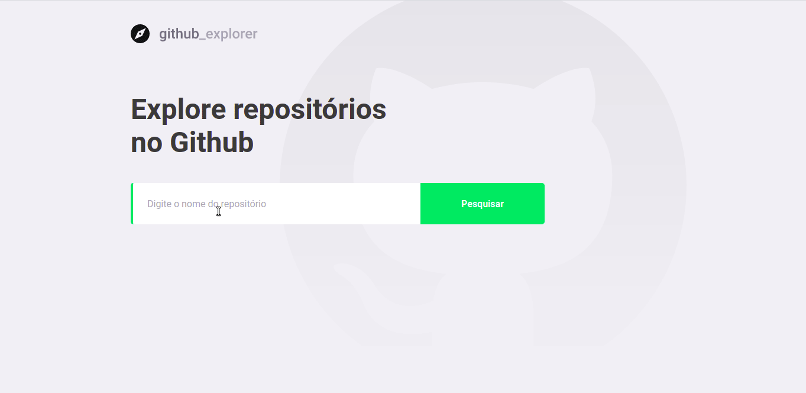

# :rocket: Github Explorer

Desenvolvido com ReactJS e Typescript para praticar os fundamentos das tecnologias, essa aplicação web permite que você explore seus repositórios favoritos.



## Principais tecnologias

- [ReactJS](https://reactjs.org/)
- [Typescript](https://www.typescriptlang.org/)
- [styled-components](https://styled-components.com/)
- [react-router-dom](https://reacttraining.com/react-router/web/guides/quick-start)
- [Axios](https://github.com/axios/axios)

Além das tecnologias foram adicionadas configurações de ESLint, Prettier e editorConfig para padronização e organização na escrita de código.

## :computer: Rodar a aplicação

A aplicação acessa a api pública disponibilizada pelo Github. Para rodar a aplicação:

```bash
# Clone this repository
$ git clone https://github.com/marciofrancalima/github-explorer.git (or use ssh)

# Go into the repository
$ cd github-explorer

# Install dependencies
$ yarn install

# Run the app
$ yarn start
```

---

Made with ♥ by Márcio França Lima. [Contact me](https://www.linkedin.com/in/m%C3%A1rcio-fran%C3%A7a-lima-916454187/)
